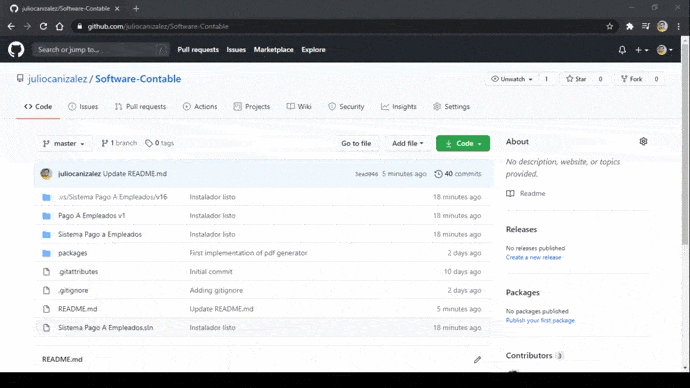

# Software-Contable

Sistema de pago a empleados, creación de constancias, recálculos de renta, y prueba del DET.

Proyecto realizado por estudiantes de Ingeniería en Desarrollo de Software de la Universidad Católica de El Salvador

[Descargalo Aquí](Sistema%20Pago%20a%20Empleados/Debug/Sistema%20Pago%20a%20Empleados.msi)

## Instrucciones de descarga

